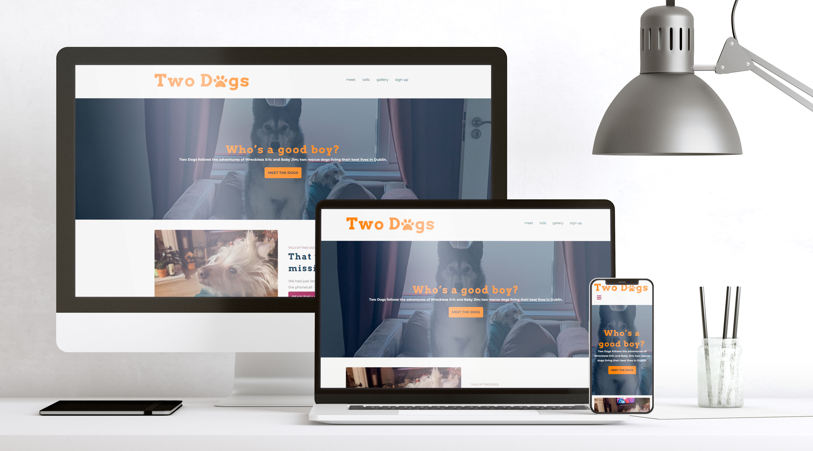
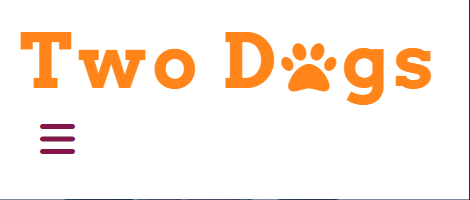
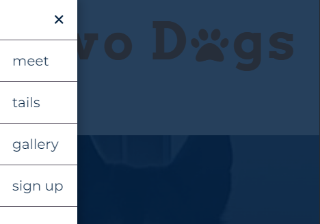
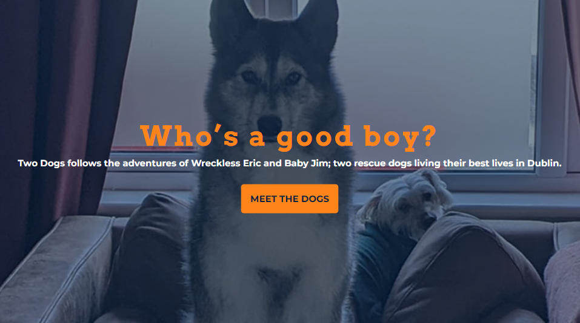
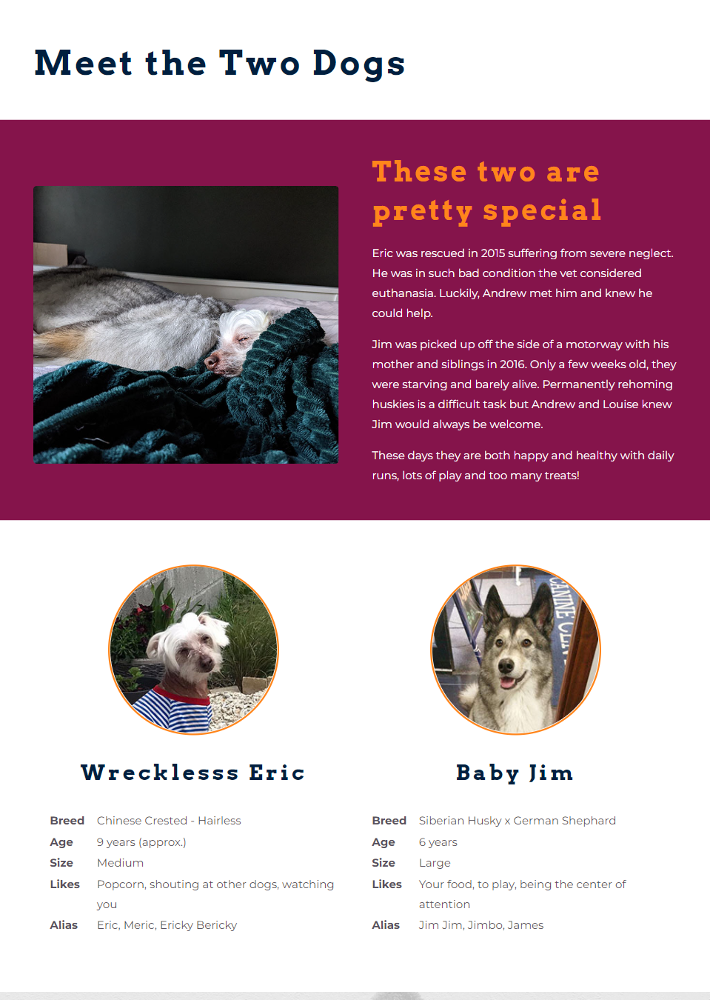
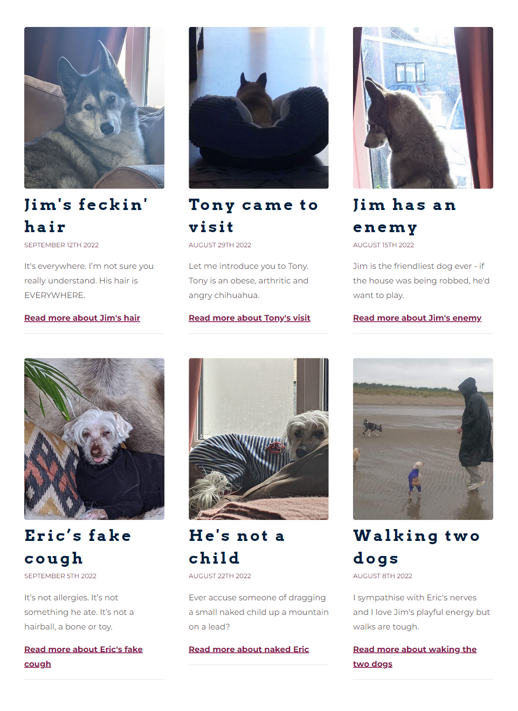
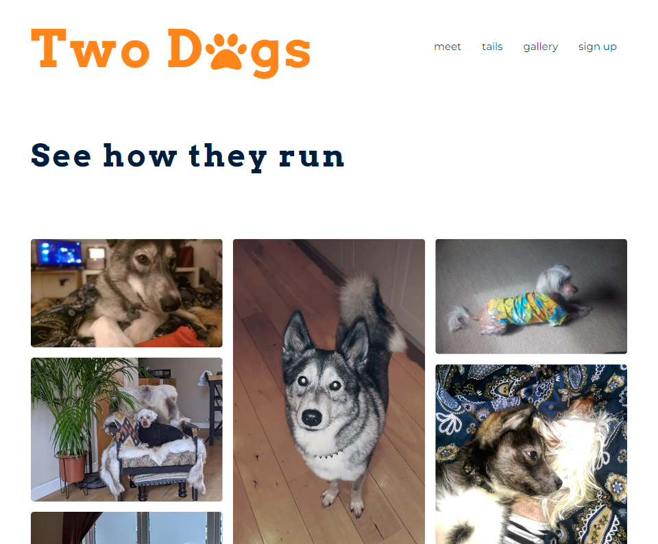
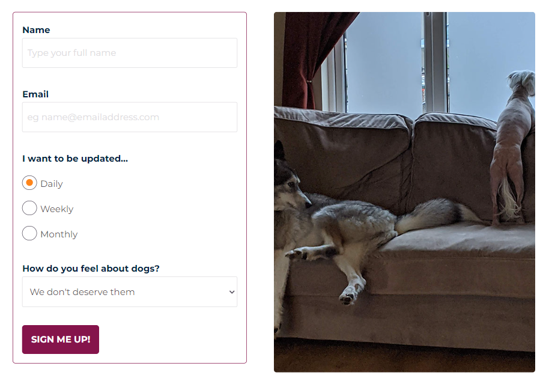

<h1>Welcome to Two Dogs!</h1>

Two Dogs is a blog site that hopes to bring light-hearted and entertaining content by showcasing events in the life of the Two Dogs - Wreckless Eric and Baby Jim. It includes stories, images and videos about what they get up to in their day-to-day life.

<strong>The live site can be found <a href="https://somekindofdesign/two-dog.github.io/two-dogs/index.html">here</a>
</strong>
 

Image by <a href="https://www.freepik.com/free-psd/artist-room-decorated_12220977.htm#query=device%20mockup&position=1&from_view=keyword">Freepik</a>

 

<h2>Audiences</h2>

The target audience for this site is consumers of online entertainment with a cross section of dog-lovers. It's primary source of traffic will be through social media channels. If the site is successful, it is expected that a portion of users will come from signing up to the blog.

It is anticipated that due to the nature of the site, users will predominatly use their mobile phone to use the Two Dogs site. This should be verified as the site gathers traffic.

<ul>
<strong>User Stories</strong>
<li>As a dog lover and online content consumer I want to view content relating to dogs online</li>
<li>As a dog lover and online content consumer I want to view content relating to the two dogs, Wreckless Eric and Baby Jim</li>
<li>As a fan of the Two Dogs blog, I want to keep up to date with the latest blog posts through email</li>
</ul>
 

<h2>Features</h2>

The first release of the Two Dogs site includes several vital features which are detailed below. Future releases should include additional features as outlined in the 'Features Left to Implement' section.

 

<h3>Existing Features</h3>
<strong>The navigation bar</strong>

Featured on all pages, this fully responsive navigation includes links to the landing page, the meet page, the tails blog page, the gallery and the blog sign up page. It is exactly replicated across the site to ensure consistency for the user.

The navigation allows users to browse the site from any page without having to use the back button on their device.

It uses code from ??. This particular piece of code was used as it included consideration for users of screen readers, increasing the reach of the accessibility of the site.

 

<strong>The landing page hero image</strong>

The landing page opens up to an image of the two dogs, enticing the user to explore the site further and find out more about them. The image has a slight zoom to help focus the user on the call-to-action, beginning their journey on the site.

 

<strong>The footer</strong>

The footer includes links to relevant social media sites, opened in new tabs to avoid taking the user away from this site.

 

<strong>The meet page</strong>

The meet page introduces users to the Two Dogs and allows them to learn some basic facts about their history and personality including likes and dislikkes. This is important in building interest with the audience.

 

<strong>The tails blog</strong>

The Tails Blog houses blog posts giving detailed stories about the Two Dogs lives. Users will find written content, images and videos updated frequently here. This is the main focus of the website and will grow over time as new content is added.

 

<strong>The gallery</strong>

The gallery contains visual content of the dogs including from the Tails blog posts and completely new content. It supports the core feature of the site, the blog.

 

<strong>The sign up page</strong>

The sign up page includes a sign up form that allows users to opt in to periodical emails containing the latest stories from the Two Dogs lives. Users are in control of the frequency of the emails received. To encourage users to sign up, there is a call-to-action in the form of a banner throughout the site.

 

<h3>Features Left to Implement</h3>
<ul>
    <li>CMS for adding and organising blog posts and image/video content</li>
    <li>Automated emails to subscribed users with optional daily, weekly or monthly updates</li>
    <li>Comments and social sharing on blog posts</li>
    <li>Improved image delivery for getter quality and optimised performance</li>
    <li>Implement custom 404 page (page has been built in this release, implementation blocked by git restrictions)</li>
</ul>
 

<h2>Testing</h2>

Throughout the development of this site, testing was carried out on different devices using the developer tools on multiple browsers including Chrome, Firefox and Microsoft Edge on Windows 10.

This was repeated towards the end of the project using the free testing tool on <a href="https://live.browserstack.com/dashboard">BrowserStack.com</a>, while extending the reach of testing to other Windows OS, the broswer Safari and multiple MacOS. It is worth noting that as this is a free tool, the accuracy of the tests may be limited.

For all testing, each page was reviewed across the following criteria;
<ul>
    <li>Layout and positioning (ie is everything where it's expected to be on all devices)</li>
    <li>Functions (ie buttons, links, inputs, etc)</li>
    <li>Features (ie image rendering, form fill and submission, etc)</li>
    <li>Consistency, convention and expectation (ie does it allow affordance to the user)</li>
</ul>

The site was evaluated by Google's Lighthouse and Page Speed tools. As performance is not optimal, improvements were investigated such as using webp images or minfying the CSS. Both resulted in the score lowering even further, by as much as 10 points in the case of the image file type. In place of the recommendations from Google this release uses source sets and mulitple css files, resulting in marginal improvements from the first audit. Further investigation into the recommended changes should take place for future releases.

<strong>Lighthouse</strong>
<ul>
    <li>Performance - 77</li>
    <li>Accessibility - 100</li>
    <li>Best Practices - 100</li>
    <li>SEO - 100</li>
</ul>
 

<strong>Page Speed</strong>
<ul>
    <li>Mobile - 77</li>
    <li>Desktop - 97</li>
</ul>
 

<strong>UAT</strong>

In addition, remote user acceptance testing was conducted with 3 users; two using mobile devices and one using a desktop. Users reported a satisfactory experience, with no difficulty using or understanding the website. One user reported a typo.

 

<h3>Validator Testing</h3>

During initial testing, opportunity to refactor the code were discovered and an attempt was made to improve it. This resulted in larger changes than expected, such as the move to using styled sections over individually targeted elements, which required additional fixes and further testing before release.

 

<strong>HTML</strong>

In the first round of html validator testing, button tags and section/article tags were found to be used incorrectly. In addition, there were a small number of open and unnecessary tags that needed to be addressed.

The second round, conducted after implementing the new structure, found an open div on the index page, sections incorrectly used in place of divs and some stray tags. In two instances, changing the section to div required updating the css file to maintain syles.

The third and final round of testing before deployment returned no errors for this project.

 

<strong>CSS</strong>

In the first round of css validator testing, some unclosed attributes were found. This highlighted that these attributes were unecessary to the output of the code and were removed.

The second round, conducted after implementing more efficient css, found two parse errors. In addition, it warned of the use of the deprecated property 'clip'.

The third and final round of testing before deployment returned no errors for this project.

 

<h2>Unfixed Bugs</h2>
<ul>
    <li>Some divs and/or sections are not extended the height of their content on screens below 768px</li>
    <li>The mobile menu drawer should be wider and float to the right</li>
    <li>The hamburger menu icon on mobile screens should float right</li>
    <li>On very small screens (below 375px) the logo breaks onto two lines</li>
    <li>Buttons are not full width on screens below 768px, resulting in some breaking onto two lines on very small screens</li>
    <li>On Firefox and Safari the custom success page redirect brings users to the Code Institute 'form dump' confirmation page</li>
    <li>On Chrome, Opera and Samsung mobile apps, the Code Institute 'form dump' confirmation page opens in a new tab or pop up while redirecting to the success page on the original tab</li>
    <li>On Firefox and Safari, custom input styling is overwritten by browser defaults.</li>
    <li>On Samsung mobile app, dark mode alters colors</li>
</ul>

<h2>Deployment</h2>

As part of the Code Institute submission process, this site was deployed to GitHub pages. The steps to deploy are as follows:
<ol>
    <li>Open github.com and log in to user account</li>
    <li>Find Two-Dogs repository</li>
    <li>In the GitHub repository, navigate to the Settings tab</li>
    <li>Find the page section on the left hand menu</li>
    <li>Check source is 'Deploy from branch'</li>
    <li>Check branch is 'main'</li>
    <li>Click save</li>
</ol

<strong>The live site can be found here - <a href="https://somekindofdesign/two-dog.github.io/two-dogs/index.html">https://somekindofdesign/two-dog.github.io/two-dogs/index.html</a>
</strong>
 

<h2>Credits</h2>
<h3>Code</h3>

The code from this project was implemented by the project owner, Louise Stanley. Additional help, guidance and solutions were also used from the below sources.

 

<strong>Code Institute - Love Running Walkthrough Project</strong>
    <ul>
    <li><a href="https://learn.codeinstitute.net/courses/course-v1:CodeInstitute+LR101+2021_T1/courseware/4a07c57382724cfda5834497317f24d5/6fd29d155c3b42248ff57bae32978a4b/">Creating the Hero Image</a> for the hero image and text on the landing page</li>
    <li><a href="https://learn.codeinstitute.net/courses/course-v1:CodeInstitute+LR101+2021_T1/courseware/4a07c57382724cfda5834497317f24d5/12ba169db7b34b82b137edd825af6a02/">Creating the Club Ethos</a> for the circle containers of the dog profiles on the Meet page</li>
    <li><a href="https://learn.codeinstitute.net/courses/course-v1:CodeInstitute+LR101+2021_T1/courseware/4a07c57382724cfda5834497317f24d5/e6d4cda2bc08458ba94d2092be9bad3a/">Site Footer</a> for the social media links and the footer</li>
    </ul>

<strong>W3Schools</strong>
    <ul>
    <li><a href="https://www.w3schools.com/howto/howto_css_custom_checkbox.asp">How TO - Custom Checkbox</a> for styling the checkboxes on the sign up form</li>
    <li><a href="https://www.w3schools.com/howto/howto_css_blog_layout.asp">How TO - Blog Layout</a> for the structure of the blog and image gallery</li>
    </ul>

<strong>Slider Revolution</strong>
    <ul>
    <li><a href="https://www.sliderrevolution.com/resources/styling-radio-buttons/">Styling Radio Buttons with CSS</a> for styling the radio buttons on the sign up form</li>
    </ul>

<strong>Medium</strong>
    <ul>
    <li><a href="https://heyoka.medium.com/responsive-pure-css-off-canvas-hamburger-menu-aebc8d11d793">Responsive, Pure CSS Off-Canvas Hamburger Menu</a> for implementing a hamburger menu on smaller devices</li>
    </ul>
     

<h3>Content</h3>

Although the content is unique, the project including layout, features and readme file were guided by the Code Institute <a href="https://learn.codeinstitute.net/courses/course-v1:CodeInstitute+CSSE_PAGPPF+2021_Q2/courseware/66cf361c769a41d496f5001fae6f9be7/3b5cd5dc8313462aa5975a3c9b9a1a3c/">Portfolio 1 Assessment Guide</a>.

All written content was provided by the project owner, Louise Stanley.

 

<h3>Media</h3>

Images and videos were generated by Louise Stanley with the exception of the background image for the About Breeds section. Please see content creator information below.
<ul>
    <li>
    Photo by <a href="https://unsplash.com/@hannah15198?utm_source=unsplash&utm_medium=referral&utm_content=creditCopyText">Hannah Lim</a> on <a href="https://unsplash.com/s/photos/breeds?utm_source=unsplash&utm_medium=referral&utm_content=creditCopyText">Unsplash</a>
    </li>
</ul>

 